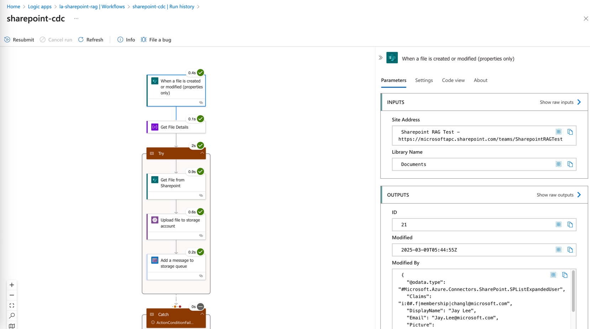
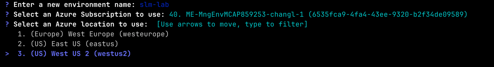
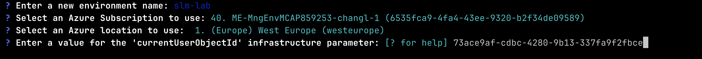
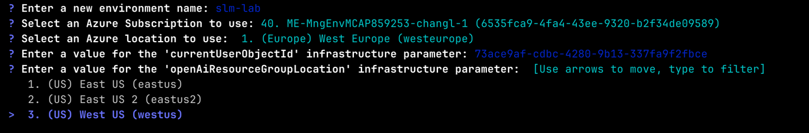

# RAG Innovator Lab

Welcome to the "RAG Innovator Lab," a hands-on workshop designed to explore and learn the implementation of Retrieval-Augmented Generation (RAG) with Azure AI Services. In this lab, we aim to tackle the challenges of eliminating inefficiencies by boiler plate c Additionally, we will discuss critical considerations for ensuring accurate, reliable, and trustworthy AI-generated responses. 

This hands-on lab covers the following topics:

1. **RAG Overview**: Understand the fundamentals of RAG and its applications in real-world scenarios.
2. **Embedding Techniques**: Learn how to chunk various data types (text, images, tables) into embeddings for RAG using Azure Document Intelligence and Azure AI Search. 
3. **Build Data Processing Pipelines**: Use LogicApps to feed data from Sharepoint to create embeddings for RAG.



## Lab Preparation

- **Azure subscription with access enabled for the Azure OpenAI service**. You can request access with [this form](https://aka.ms/oaiapply)
- In order to prepare the environment for the hands-on lab, your Azure account must have the right permissions. 
  - Your Azure account must have `Microsoft.Authorization/roleAssignments/write` permissions, such as `Role Based Access Control Administrator`, `User Access Administrator`, or `Owner`. If you don't have subscription-level permissions, you must be granted RBAC for an existing resource group and deploy to that existing group.
  - Your Azure account also needs `Microsoft.Resources/deployments/write` permissions on the subscription level.


### Azure Resources Preparation

This hands-on lab requires the following Azure resources. Please ensure that you have the necessary permissions and quotas to create and use these resources:

| Azure Resources             | Note                                                                                  |
|-----------------------------|---------------------------------------------------------------------------------------|
| Azure OpenAI Models         | ex. gpt-4o-mini, text-embedding-2-ada                                                 |
| Azure AI Search             |                                                                                       |
| Azure Document Intelligence | v4.0 which is only available in one of three regions : East US, West US2. West Europe |
| Storage Account             | To stage and embed files from Sharepoint. Also Storage Queue for event processing     |

> [!WARNING]
> Please create a resource in one of following regions when creating a AI Document Intelligence resource: **East-US, West-US2, West-Europe**. Otherwise, you may encounter a 404 error when trying to access the resource. ([Source](https://learn.microsoft.com/en-us/answers/questions/1514842/document-intelligence-ai-returns-404))

> [!NOTE]
> For managed online endpoints, [Azure ML reserves 20% of the quota for the deployment].[^1] If you request a given number of instances for those VM SKUs in a deployment, you must have a quota for `ceil(1.2 × number of instances requested for deployment) × number of cores for the VM SKU` available to avoid getting an error. For example, if you request 1 instances of a `Standard_NC6s_v3` VM (that comes with six cores) in a deployment, you should have a quota for 12 cores (ceil(1.2 × 1 instances) = 2, 2 × 6 cores) available.

### Deploying Azure resources with Azure Developer CLI (`azd`)

In case you're looking for the easiest way to get started, this lab provides Bicep template to provision everything with a few steps. The steps below will provision required Azure resources for the lab. Download the CLI from the [What is the Azure Developer CLI?](https://learn.microsoft.com/en-us/azure/developer/azure-developer-cli/overview?tabs=windows#a-sample-azd-workflow) and [Install the Azure CLI on Linux ](https://learn.microsoft.com/en-us/cli/azure/install-azure-cli-linux?pivots=apt)if you don't have it installed yet. 

Login to your Azure account:

```shell
azd auth login
```

For GitHub Codespaces users, if the previous command fails, try:

```shell
azd auth login --use-device-code
```

As we need to assign the required permissions to new Azure resources, Get the objectId of current user by running the below command and take a note of it. It will be referred as `currentUserObjectId`. :

```shell
az ad signed-in-user show --query id  --output tsv
```

Run azd up - This will provision Azure resources required for the lab. 

```shell
azd up
```

Select one of three regions to deploy Document Intelligence: East US, West US2, West Europe.


Next, put the `currentUserObjectId` captured 



Next, choose the region to deploy Azure OpenAI models. 



After executing the `azd up` command, run `azd env get-values` to get the basic information of the resources created including Azure OpenAI models, Azure AI Search, Azure Document Intelligence, and Storage Account. 

```shell
azd env get-values
```

**Important**: Beware that the resources created by this command will incur immediate costs, primarily from the AI Search resource. These resources may accrue costs even if you interrupt the command before it is fully executed. You can run `azd down` or delete the resources manually to avoid unnecessary spending.

## Contributing

This project welcomes contributions and suggestions.  Most contributions require you to agree to a
Contributor License Agreement (CLA) declaring that you have the right to, and actually do, grant us
the rights to use your contribution. For details, visit https://cla.opensource.microsoft.com.

When you submit a pull request, a CLA bot will automatically determine whether you need to provide
a CLA and decorate the PR appropriately (e.g., status check, comment). Simply follow the instructions
provided by the bot. You will only need to do this once across all repos using our CLA.

This project has adopted the [Microsoft Open Source Code of Conduct](https://opensource.microsoft.com/codeofconduct/).
For more information see the [Code of Conduct FAQ](https://opensource.microsoft.com/codeofconduct/faq/) or
contact [opencode@microsoft.com](mailto:opencode@microsoft.com) with any additional questions or comments.

## Trademarks

This project may contain trademarks or logos for projects, products, or services. Authorized use of Microsoft 
trademarks or logos is subject to and must follow 
[Microsoft's Trademark & Brand Guidelines](https://www.microsoft.com/en-us/legal/intellectualproperty/trademarks/usage/general).
Use of Microsoft trademarks or logos in modified versions of this project must not cause confusion or imply Microsoft sponsorship.
Any use of third-party trademarks or logos are subject to those third-party's policies.
